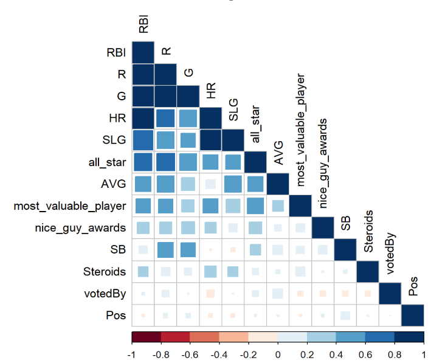
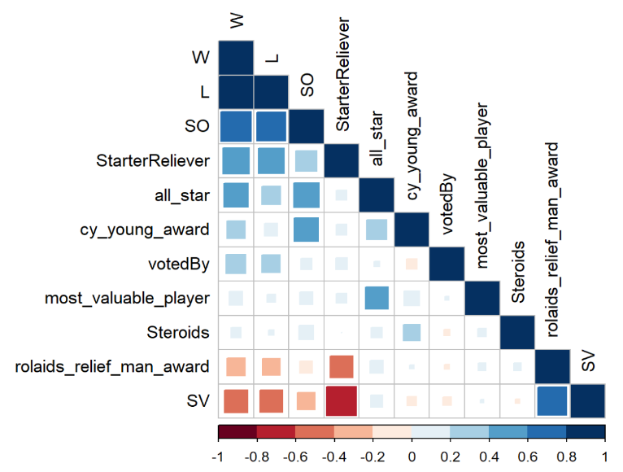
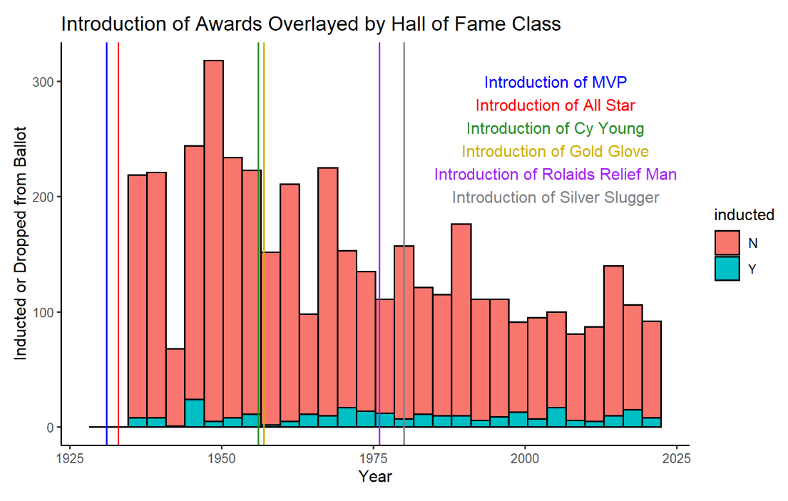
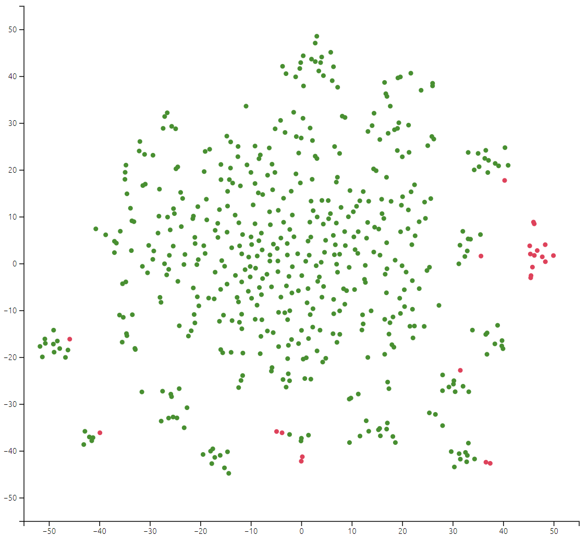
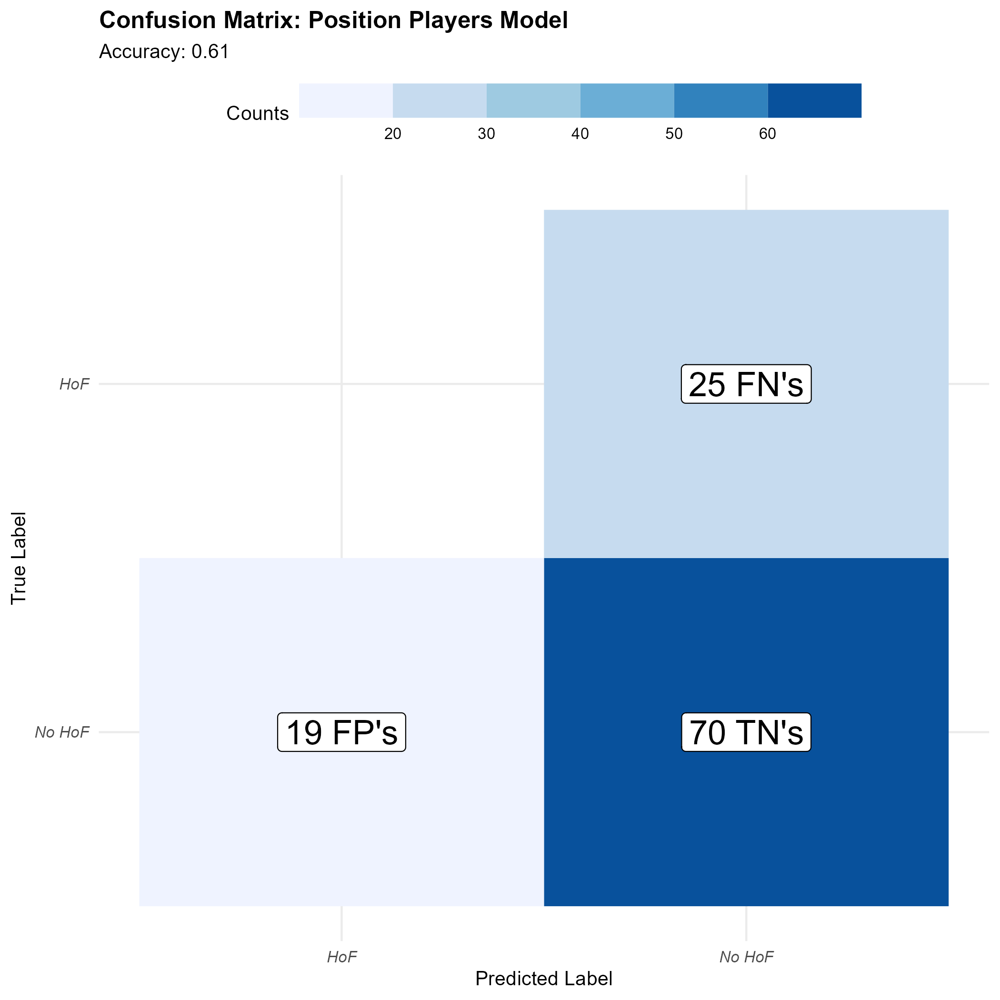
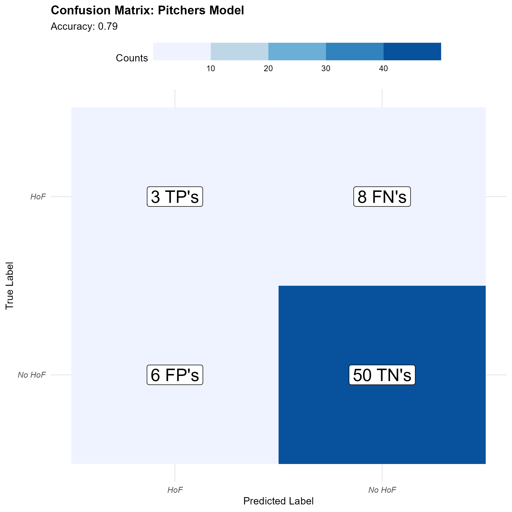
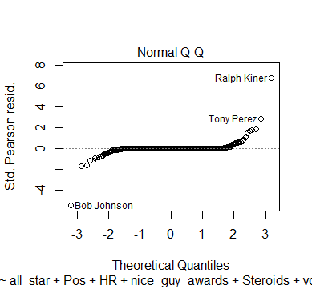
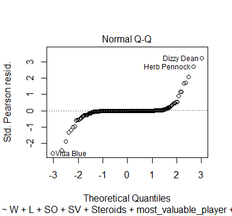
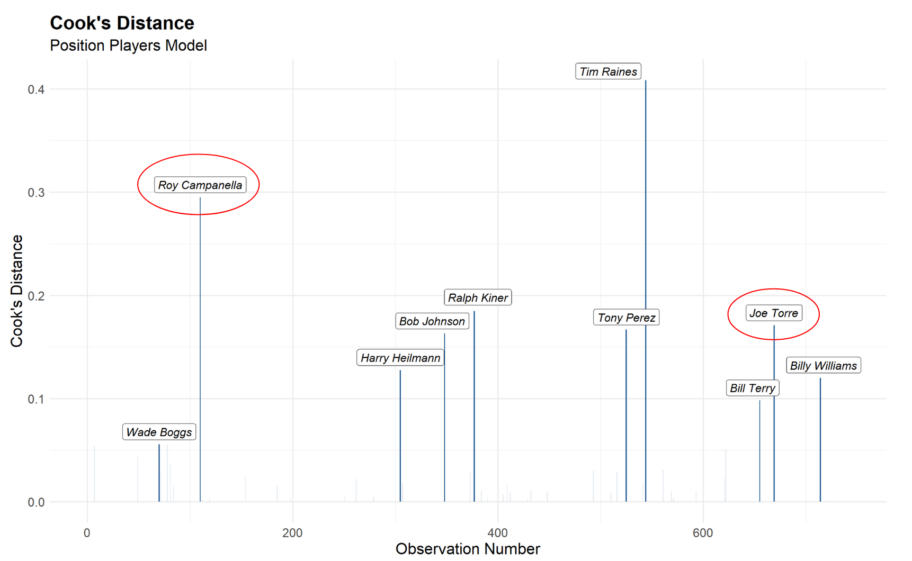
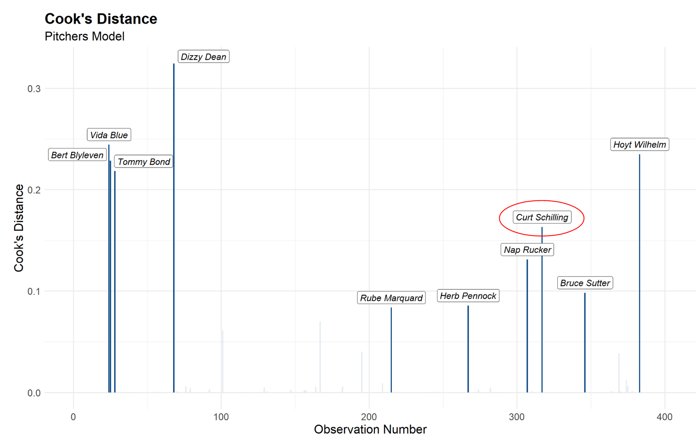

\fontsize{9}{14}
\selectfont

```{r setup, include=FALSE}
knitr::opts_chunk$set(echo = FALSE, message = FALSE, warning = FALSE)
library(stargazer)
library(tidyverse)
library(ggalt)
library(patchwork)
library(RColorBrewer)
library(equatiomatic)

load("../data/modeliters.RData")

font_family <- "sans"

make_table <- function(mod1, mod2, mod3, title) {
  stargazer(
    mod1,
    mod2,
    mod3,
    title = title,
    no.space = TRUE,
    font.size = "tiny",
    single.row = TRUE,
    table.placement = "H",
    # float = TRUE,
    header = FALSE,
    column.labels = c("Iteration 1", "Iteration 2", "Iteration 3"),
    type = "latex"
  ) %>%
    return()
}

final_pitch_glm <- glm(wein ~ W + L + SO + SV + Steroids +
                              most_valuable_player + all_star + cy_young_award +
                              rolaids_relief_man_award + votedBy +
                              StarterReliever + Steroids:most_valuable_player,
                       family = "binomial",
                       data = PitcherHOF_df)


or_conf_int_plot <- function(mod, subtitle) {
  
  or_conf_int <-
    exp(cbind("Odds ratio" = coef(mod), confint.default(mod, level = 0.95))) %>%
    data.frame() %>%
    mutate(pval = as.numeric(coef(summary(mod))[,4])) %>%
    filter(pval < .05) %>%
    select(c(1,2,3))
  
  colnames(or_conf_int) <-
    c("odds.ratio", "conf.lower", "conf.upper")
  
  or_conf_int$predictor <- row.names(or_conf_int)
  
  row.names(or_conf_int) <- NULL
  
  or_conf_int$predictor <-
    factor(or_conf_int$predictor, or_conf_int[order(or_conf_int$odds.ratio), "predictor"])
  
  p1 <- or_conf_int %>%
    filter(odds.ratio < 1) %>%
    ggplot() +
    # geom_dumbbell(
    #   aes(x = conf.lower, xend = conf.upper, y = predictor),
    #   color = "#ffa600",
    #   alpha = 0.5,
    #   size = 5
    # ) +
    geom_errorbarh(aes(xmin = conf.lower, xmax = conf.upper, y = predictor), color = "#ffa600", height = 0.2) +
    geom_point(aes(x = odds.ratio, y = predictor), color = "#003f5c", size = 2, shape = 18) +
    scale_x_log10(n.breaks = 10) +
    theme_minimal() +
    theme(
      text = element_text(size = 8, family = font_family),
      axis.text.y = element_text(face = "italic"),
      axis.text.x = element_text(size = 4, angle = 45),
      plot.title = element_text(face = "bold")
    ) +
    labs(
      x = "Odds Ratio (log scaled)",
      y = "",
      title = "Odds Ratios < 1 (95% CI)",
      subtitle = subtitle
    )
  
  p2 <- or_conf_int %>%
    filter(odds.ratio > 1) %>%
    ggplot() +
    # geom_dumbbell(
    #   aes(x = conf.lower, xend = conf.upper, y = predictor),
    #   color = "#ffa600",
    #   alpha = 0.5,
    #   size = 5
    # ) +
    geom_errorbarh(aes(xmin = conf.lower, xmax = conf.upper, y = predictor), color = "#ffa600", height = 0.2) +
    geom_point(aes(x = odds.ratio, y = predictor), color = "#003f5c", size = 2, shape = 18) +
    scale_x_log10(n.breaks = 10) +
    theme_minimal() +
    theme(
      text = element_text(size = 8, family = font_family),
      axis.text.y = element_text(face = "italic"),
      axis.text.x = element_text(size = 4, angle = 45),
      plot.title = element_text(face = "bold")
    ) +
    labs(
      x = "Odds Ratio (log scaled)",
      y = "",
      title = "Odds Ratios > 1 (95% CI)",
      subtitle = subtitle
    )
  
  return(p1 + p2)
  
}

get_confusion_matrix <- function(mod, data, title) {
  fitted <- fitted(mod)
  
  confusion_matrix <- data %>% 
    mutate(i = 1:n()) %>% 
    left_join(data.frame(i = as.numeric(names(fitted)), fit = fitted), by = "i") %>% 
    select(-i) %>%
    mutate(wein_pred = as.factor((fit > 0.5)*1)) %>%
    group_by(wein_pred, wein) %>%
    summarize(n = n()) %>%
    filter(!is.na(wein_pred)) %>% 
    mutate(label = paste0(n, " ",ifelse(wein_pred == 1 & wein == 1, "TP's", 
                          ifelse(wein_pred == 0 & wein == 0, "TN's", 
                                 ifelse(wein_pred == 1 & wein == 0, "FP's", "FN's")))))
  
  accuracy <- round(sum(confusion_matrix[(confusion_matrix$wein_pred == 0 & confusion_matrix$wein == 0) | (confusion_matrix$wein_pred == 1 & confusion_matrix$wein == 1), "n"]) / sum(confusion_matrix$n), 2)

  confusion_matrix %>%
    mutate(wein = ifelse(wein == 1, "HoF", "No HoF"), wein_pred = ifelse(wein_pred == 1, "HoF", "No HoF")) %>%
    ggplot() +
    geom_tile(aes(x = factor(wein_pred, level = c("HoF", "No HoF")), y = factor(wein, level = c("No HoF", "HoF")), fill = n)) +
    geom_label(aes(x = wein_pred, y = wein, label = label), size = 6, fill = "#ffffff") +
    scale_fill_fermenter(direction = 1) +
    theme_minimal() +
    theme(
      legend.position = "top",
      legend.key.width=unit(2,"cm"),
      text = element_text(size = 10, family = font_family),
      axis.text.x = element_text(face = "italic"),
      axis.text.y = element_text(face = "italic"),
      plot.title = element_text(face = "bold")
    ) +
    labs(x = "Predicted Label", y = "True Label", title = paste0("Confusion Matrix: ", title), subtitle = paste0("Accuracy: ", accuracy), fill = "Counts") %>%
    return()
}

```

## Introduction

#### Background and Motivation
The data we are working with is career baseball statistics. The data was collected from official scorekeepers who went to every Major League Baseball game and tracked various outcomes players had over the course of each game. For our finished data set, those statistics were added up at the end of each baseball season and also at the end of each player’s career. The motivation for the scorekeepers to track the data was that they were paid, either by the home team, the league as a whole, or the local newspaper to track these statistics to keep baseball fans informed. 

One motivation for our research question was to better understand which variables are associated with a successful hall of fame induction. Another motivation for our research is an extension of the first, which is for us to predict which players will be inducted into the hall of fame in the future. 

#### Research Question
As such, our first research question is what factors are associated with a  position player being inducted into the hall of fame and whether we can create a model that uses these factors to predict what players will make the hall of fame. Our other research question is what factors are a associated with whether a pitcher is inducted into the hall of fame and whether we can create a model that uses these factors to predict what pitchers will make the hall of fame. 

We'll be using R version 2022.02.3+492 throughout this project, so please update to at least R version 2022.02.3+492 to be able to replicate our process.

## Data Description
Our data consists of mostly quantitative variables mixed in with some categorical variables. Most baseball metrics come in quantitative form so it is often hard to obtain categorical measurements unless they come directly from the quantitative variables itself. However, some categorical variables we may use include factors such as year, league, team, stint, and possibly some other categorical variables that are computed from other quantitative variables. One other potential categorical variable would be a binary variable indicating whether a player was known to use steroids or not. 

Furthermore, we are splitting this project into two parts: batters and pitchers. Thus, there is a need to split the data; in other words, we’ll have two different data sets, since metrics for batters and pitchers are vastly different. However, we’ll still be predicting the same variable: hall of fame. Hall of fame is a binary categorical variable (with the two values being 1 and 0), indicating whether a player was inducted into the hall of fame or not. In addition, we made sure to only include players who were on a hall of fame ballot at some point. In total, we have around 750 observations in the position players training data set and 400 observations in the pitching training data set.

## Exploratory Data Analysis

#### Correlation Plots

|Position Players|Pitchers|
|:-:|:-:|
|{width=150px, height=150px}|{width=150px, height=150px}|

We can see that a few of our variables have multicollinearity, especially the hitting rate stats which are amalgamations of counting hit stats. However not all predictor are as correlated.

#### Awards EDA & Steroids SVD plots

|Awards and Elected Counts|Steroids Clusters|
|:-:|:-:|
|{width=150px, height=150px}|{width=150px, height=150px}|

A time plot showing the total counts of players inducted and dropped off the ballot. Introduction of awards overlaid to explain a lack of significance which we might see for accolades introduced in the mid 20th century after a large proportion of total players who have ever been on ballot had already been inducted or dropped off. Below are the cumulative percentages of the proportion of players who had either been inducted into the hall of fame or dropped off the ballot by the time each award was introduced. As we see, almost 2/3 of players who had ever been on the ballot had their Hall of Fame candidacy decided before the introduction of the Silver Slugger award.
 
* Before MVP & All-Star – 0%
* Before Cy Young and Gold Glove Award ~ 33.9%
* Before Rolaids Reliever of the Year and Silver Slugger Award ~ 61%

As we can tell from this clustering, many of the position players who took steroids throughout their career have eerily similar career statistics. As such, it made sense to make `Steroids` its own variable.

## Methods

#### Family-wise Error
For our hypothesis testing, since we use so many coefficients for both models, our family wise error rate would be high. As such, we are going to use the Bonferonni correction. This gives us that the significant p-values are 0.0015 for Position Players and 0.0042 for Pitchers.

#### Assumptions
We are assuming a constant probability of being elected into the Hall of Fame throughout the history of baseball, a necessary assumption for logistic regression with a binomial random variable response. Addtionally, we are assuming homoskedaskity and normally distributed errors which we will show through qqplots after we have filtered our data properly. Lastly, we are assuming each observation is independent of one another, which we must be careful with. Baseball is a series of one-on-one match ups between a batter and a pitcher. It is zero-sum, meaning the sucess of a pitcher is correltated to the failure of a batter. However, because the number of times any hitter will face the same pitcher is negliable compared to the amount of pitchers the batter will otherwise face throughout their entire career, we will assume independence.

#### Data Wrangling

* For batters, we began summing across playerID groups in the "Batting" data frame within the Lahman package. This allowed us to see career totals for recognizable rate and counting stats for each observation (player) like batting average, walks, plate appearances, and total hits for each of the four base categories. We then joined a pivoted "award" data frame that added approximately 20 accolade predictors for each observation, this includes total all-star selections, most valuable player awards won, silver sluggers, etc. 

* For pitcher, we began summing across playerID groups in the "Pitching" data frame within the Lahman package. This allowed us to see career totals for recognizable rate and counting stats for each observation (pitcher) like innings pitched (a starter would typically pitch ~ 150 in a season), strike outs, earned runs, and we additionally mutated $\frac{9 \times ER}{IP}$ and $\frac{W + H}{IP}$ to get the all important earned run average and WHIP rates. We then joined a pivoted "award" data frame that added approximately 20 accolade predictors for each observation, this includes total all-star selections, Cy Young awards won, Gold Gloves, etc. 

In addition to the base covariates, a large initial AIC from our step() selection process and some rather large Cook's Distance values indicated the necessity to mutate additional predictors. 

* The late 90's, early 2000's Steroids era of baseball altered the way BBWAA voters viewed the careers of some players in spite of otherwise Hall of Fame worthy numbers. And so, using webscraped data from ESPN and Bay Area Laboratory Co-operative (BALCO) court documents, we mutated a binary 0/1 column that indicated if a player was indited on any sort of performance enhancing drug (PED) scandal.
  
* We then ran our step() model selection process again, and while we obtained better AIC values, we felt we could do better. We understood what the baseball writers considered important to be elected into the Hall of Fame was period and cohort dependent. Therefore, we mutated a column that signified which of two committees elected a player into the Hall of Fame; the Baseball Writers Association of America (BBWAA) or the Veterans Committee. The BBWAA typically votes players who appeal to modern analytics of what makes a player well Hall of Fame worthy, while the Veterans Committee typically votes players based on high batting averages or nepotism from the dead-ball era of baseball (1880-1920).

* For position players specifically, we felt the need to mutate in a variable which identifies the primary position of a player throughout their career. This is important because of something called "Positional Adjustment". Based on the defensive difficulty of each position, a player is typically expected preform at a certain offensive level to be cosidered good. For example, a first-baseman who has what is considered an easy position defensively, is expected to preform far better offensively than a player at the catcher position, which is considered the most difficult defensive position according to FanGraphs Positional Adjustment.

* For pitchers, preliminary parameter selection via the step() function revealed the importance of relief pitcher accolades. Relief pitchers are a subset of pitchers who typically pitch ~ 60 inning a season. We felt the need for our model to be differentiate between a starter and relief pitcher, and so we mutated a predictor which identifies if a pitcher is a starter or reliever based on seasonal innings pitched totals.

#### Model Selection
For our model building, we used essentially every possible variable that could potentially be useful and did not contain too many missing values. As such, we started our process with even larger models than ones we already had To narrow down the number of covariates, we used step-wise model selection that goes both forwards and backwards, allowing us to test as many models as possible. Since we are more focused on the prediction aspect, we chose to use AIC as our primary criteria for model selection over other criteria such as BIC. 

In addition, we attempted to utilize AIC over K-fold CV and LOOCV because of the following:

|Position Players|Pitchers|
|:-:|:-:|
|{width=150px, height=150px}|{width=150px, height=150px}|

Our position player model seems to be identifying the non-hof players correctly but is not able to correctly identify any hof players. This could possibly stem from the problem that there is an imbalance in the data set as there are many more non-hof players compared to hof players (~ 18% of players are in the Hall of Fame in both batter and pitcher data frames) Thus, CV may not be practical for our data and make because of its expected behavior.

## Results


```{r message=FALSE, echo=FALSE, results='asis'}
make_table(pitcher1, pitcher2, final_pitch_glm, title = "Pitchers Model(s)")
```

```{r message=FALSE, echo=FALSE, results='asis'} 
make_table(position1, position2, final_pos_glm, title = "Position Players Model(s)")
```

The former tables are the summary information of the models we obtained from many iterations of trying different variables for both pitchers and position players. Further, the first iteration is considered the "base" model which includes all the basic measurements in our dataset as it doesn't include manipulated data like `steroids` and `votedBy`, both variables which needed further research to obtain. The second iteration includes the variables we didn't include in the first iteration whilst the third and final model includes interactions of any variables as well. Thus, the third iteration can be considered the most complex model out of the 3.

As you can observe, the AIC for the models go down as we clean up the variables and add interactions, so we ended up settling with the last model which gave us the lowest AIC.

Our final models are as follows:

```{r results = 'asis'}
extract_eq(final_pos_glm, wrap = TRUE, intercept = "beta", ital_vars = TRUE, use_coefs = TRUE, terms_per_line = 3)
```

```{r results = 'asis'}
extract_eq(final_pitch_glm, wrap = TRUE, intercept = "beta", ital_vars = TRUE, use_coefs = TRUE, terms_per_line = 3)
```

#### Coefficients

In this section, we take a look at the coefficients that were computed from our model, specifically we look at the odds ratio and the corresponding 95% confidence interval to gain insight on what kind of variables may be important in our final models. Note, only the parameters with < .05 p-value have plotted odds ratios below.

```{r fig.cap = "Position Players Odds Ratio CI", out.width="80%", out.height="80%"}
or_conf_int_plot(final_pos_glm, "Position Players Model")
```

```{r fig.cap = "Pitchers Odd Ratio CI", out.width = "80%", out.height="80%"}
or_conf_int_plot(final_pitch_glm, "Pitchers Model")
```

From both of these charts we can see which coefficients, and their corresponding odds ratios, were the largest and most likely to be associated with increasing/decreasing hall of fame likelihood. While not significant, and therefore not included above in the plot, one thing of note is that the `Steroids` coefficient is positive, but that does not include the interaction of `Steroids` with `SLG`, which means that the overall effect `Steroids` has on the chance a player has to get in the hall of fame is still negative.

#### QQ-Plots Diagnostics

|Position Players|Pitchers|
|:-:|:-:|
|{width=150px, height=150px}|{width=150px, height=150px}|

As we can tell, for both the hitting and pitching models, the models have a  similar fit to the training data. For almost all of the values, they fit right along the line, meaning the residuals are zero or close to zero for most of the data. However, at the extremes of the theoretical quantiles, we do see some variation in the residuals away from the model for both the pitchers and position players (although the pitchers model has more extremes), so the model is not close to perfect.

#### Cook's Distance Diagnostics

|Position Players|Pitchers|
|:-:|:-:|
|{width=150px, height=150px}|{width=150px, height=150px}|

These Cook’s Distance plots pass the eye test for weird observations. Joe Torre was inducted more for his contributions to the game as baseball's Commissioner, and not so much for his prowess as a player. Roy Campanella’s Kansas City Monarch data is not included in his MLB counting stats, so our model is a bit confused to why he is inducted even though it’s entirely deserving. Curt Schilling’s character off the field has been widely attributed to why he is not elected despite his successful career.

### Prediction
In addition to how our model performed on the training data, we wanted to see how it would work on future prospective hall of fame inductees. As such, our final prediction results are published on the web application **[here](https://klobby19.shinyapps.io/explorable/)**

In terms of our our predictions, we would say that they are, for the most part, accurate. Obviously, our opinion is not a perfect evaluation of whether or not a player will get into the hall of fame, but as people who consume a lot of baseball content, as well as participate in the baseball community, we are likely fairly close to what experts in baseball statistics would look like (not to brag). However, there are a few players in which we disagree with the model's choice in the position player side, namely Adrian Beltre and Yadier Molina. This may be because of overfitting to our training data or it also could be a result of a changing criteria when it comes to what makes player hall of fame worthy. 

It is also important to note that these predictions are "now-casting" not forecasting, since we are essentially assuming that all the players that we are predicting are all retired. As such, since our model looks at many counting stats, players who are not retired yet and have low probabilities to get into the hall of fame can, in theory, improve their chances by picking up more stats over the rest of their careers. However, we still believe that our model brings valuable information regarding players who have retired or are at the end of their careers, since they are not likely to improve their chances much, if at all.

## Discussions and Conclusions

#### Interpretation
The goal of our research question has always been prediction, and thus, the AIC value which we used to assess our model has left us with many more parameters than if we used the BIC. Below are selected coefficients from our final position player and pitching glm objects. We will interpret them based on the fact that they met our family wise signifiance level, and not necissarly because they have a sign or magnitude which makes sense contextually.

* From the exponentiated `all_star` parameter $e^{\beta_{allstar}} = e^{1.321} = 3.75$, we can say for every all-star selection of a position player, the odds of being elected into the Baseball Hall of Fame increase by 3.75 times when holding all other predictors constant. From the 95% C.I. [1.95, 9.38], we are 95% confident that for every all-star appearance, the odds of being elected into the Hall of Fame increases by 1.95 to 9.38 times. This makes sense intuitively, as consistant all-star selections is synonomys with constistant player preformance. The postive feedback loop of baseball writers awards players accolades and then using those accolades to justify Hall of Fame election is shown through many parameters in both the batter and pitcher models.

* From the exponentiated `votedByVeterans` parameter $e^{\beta_{votedByVeterans}} = e^{12.89} = 396329$, we can say the odds of a pitcher being elected into the Baseball Hall of Fame increase by 396329 times if done by the Veterans Committee when holding all other predictors constant. From the 95% C.I. [1062, 39143030000], we are 95% confident that for every all-star appearance, the odds of being elected into the Hall of Fame increases by 1062 to 39143030000 times. This seems like an insane result, but when you consider how few players are considered by the Veterans Committee and how they are almost always elected into the Hall of Fame from their consideration, then it makes sense why our number seems so ludicirse based on our lack of statistical power.

We had several fringe parameters for our position player and pitcher models which did not quite meet our bonferroni correction significance levels, but were close. We listed them below on a selection criteria of being close to significant and interesting. They follow the same interpretation logic as above.

* Position Players
    + Pos2B, 530855280 w/ 95% C.I. [6199, $2.13 \times 10^{16}$]
    + VotedbyVeterans, $1.46 \times 10^{10}$ w/95% C.I.[$3.69 \times 10^{5}$, $8.47 \times 10^{19}$]

* Pitchers 
    + Wins, 1.183 w/ 95% C.I. [1.081, 1.388]
    + all_star, 3.286 w/ 95% C.I. [1.72, 10.63]

#### Limitations
We aknowledge some limiations of our processes. Firstly, our binomial random variable response of being elected into the Baseball Hall of Fame (wein) has a naturally low probability of sucess. Therefore, many cross-validation methods of model selection and assesment are unavaible to us. Additonally, our research question surrounding Hall of Fame voting is not a perfect science by any means. Any election process harbors some roots in favortism, superfical perception, and dynamic measures of sucess. Baseball Hall of Fame voting is no different. Lastly, the poor record keeping of baseball statistics prior to the mid 20th century has imparted many NA's in our data frames. This greatly reduces the power in which we can effectively measure which covaraiates are associated with Hall of Fame election.
    
#### Future
In future research, we would like to solve our issues of inproportionate predictors and the lack of power they cause. It would interesting to use time series analysis with election into the Hall of Fame as the terminating event, while also making use of cohort-predictor-time variables.

## References 

- Fangraphs. (n.d.). Positional Adjustment. Retrieved from https://library.fangraphs.com/misc/war/positional-adjustment/
- Baseball Reference. (n.d.). Baseball Statistics and History. Retrieved from https://www.baseball-reference.com/
- Lahman, S. (n.d.). The Baseball Archive. Retrieved from https://www.seanlahman.com/baseball-archive/statistics/
- Wikipedia. (2021, December 14). List of Major League Baseball players suspended for performance-enhancing drugs. In Wikipedia. Retrieved from https://en.wikipedia.org/wiki/List_of_Major_League_Baseball_players_suspended_for_performance-enhancing_drugs
- ESPN. (2009, July 31). A-Rod admits using PEDs from 2001-03. Retrieved from https://www.espn.com/mlb/news/story?id=4366683
- RStudio Team (2022). RStudio: Integrated Development for R. RStudio, PBC, Boston, MA URL http://www.rstudio.com/.
- R Core Team (2022). R: A language and environment for statistical computing. R Foundation for Statistical Computing, Vienna, Austria. URL https://www.R-project.org/.

## Appendix

* All: General data tydying including the joining, mutation, and filtering necessary for analysis. Developed presentation slides and report. Quality control of final report.
* Andy: 
* Dante: Proposed research question and gathered initial datasets. Deligated tasks based on skills of team members and project needs. Awards EDA. Odd ratios interpretation, Cook's Distances, impact of our results.
* Kai:
* Kobe: 
