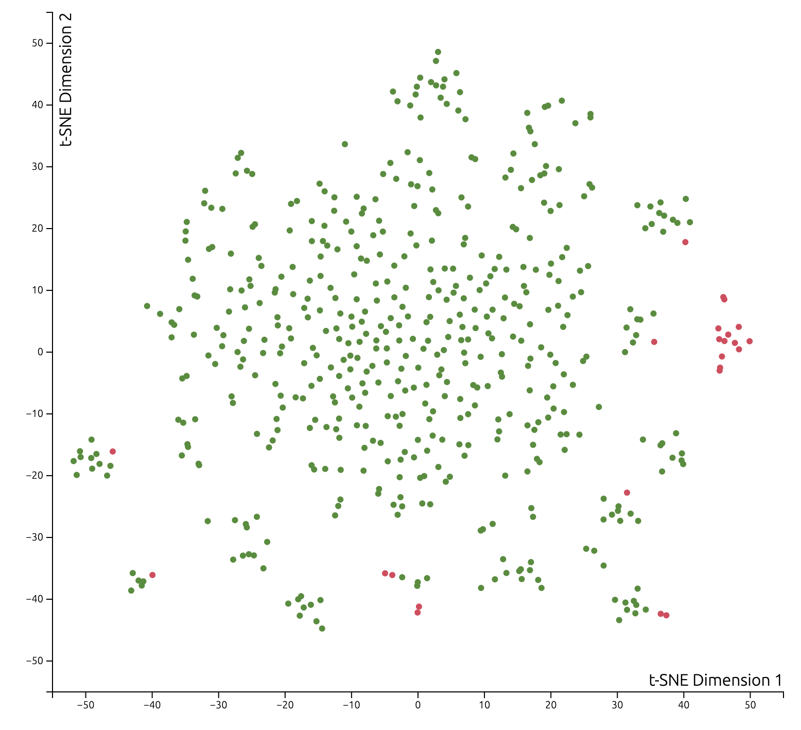

```{r setup, include=FALSE}
knitr::opts_chunk$set(echo = TRUE)
```

## Introduction
The data we are working with is career baseball statistics. The data was collected from official scorekeepers who went to every Major League Baseball game and tracked various outcomes players had over the course of each game. For our finished data set, those statistics were added up at the end of each baseball season and also at the end of each player’s career. The motivation for the scorekeepers to track the data was that they were paid, either by the home team, the league as a whole, or the local newspaper to track these statistics to keep baseball fans informed. 

One motivation for our research question was to better understand which variables are associated with a successful hall of fame induction. Another motivation for our research is an extension of the first, which is for us to predict which players will be inducted into the hall of fame in the future. 

As such, our first research question is what factors are associated with a  position player being inducted into the hall of fame and whether we can create a model that uses these factors to predict what players will make the hall of fame. Our other research question is what factors are a associated with whether a pitcher is inducted into the hall of fame and whether we can create a model that uses these factors to predict what pitchers will make the hall of fame. 

## Data Description
Our data consists of mostly quantitative variables mixed in with some categorical variables. Most baseball metrics come in quantitative form so it is often hard to obtain categorical measurements unless they come directly from the quantitative variables itself. However, some categorical variables we may use include factors such as year, league, team, stint, and possibly some other categorical variables that are computed from other quantitative variables. One other potential categorical variable would be a binary variable indicating whether a player was known to use steroids or not. 

Furthermore, we are splitting this project into two parts: batters and pitchers. Thus, there is a need to split the data; in other words, we’ll have two different data sets, since metrics for batters and pitchers are vastly different. However, we’ll still be predicting the same variable: hall of fame. Hall of fame is a binary categorical variable (with the two values being 1 and 0), indicating whether a player was inducted into the hall of fame or not. In total, we have around 750 observations in the position players training data set and 400 observations in the pitching training data set,.


## Exploratory Data Analysis


#### Steroids Clustering
{width=150px, height=150px}

## Methods

Each of our pitcher and batter (position player) data frames consisted of 50 base variables after the conclusion of our various join functions. 
(BULLET POINT HERE) For batters, we began summing across playerID groups in the "Batting" data frame within the Lahman package. This allowed us to see career totals for recognizable rate and counting stats for each observation (player) like batting average, walks, plate appearances, and total hits for each of the four base categories. We then joined a pivoted "award" data frame that added approximately 20 accolade predictors for each observation, this includes total all-star selections, most valuable player awards won, silver sluggers, etc. 
(BULLET POINT HERE) For pitcher, we began summing across playerID groups in the "Pitching" data frame within the Lahman package. This allowed us to see career totals for recognizable rate and counting stats for each observation (pitcher) like innings pitched (a starter would typically pitch ~ 150 in a season), strike outs, earned runs, and we additionally mutated $\frac{9 \times ER}{IP}$ and $\frac{W + H}{IP}$ to get the all important earned run average and WHIP rates. We then joined a pivoted "award" data frame that added approximately 20 accolade predictors for each observation, this includes total all-star selections, Cy Young awards won, Gold Gloves, etc. 

In addition to the base covariates, a large initial AIC from our step() selection process and some rather large Cook's Distance values indicated the necessity to mutate additional predictors. 
(BULLET POINT HERE) The late 90's, early 2000's Steroids era of baseball altered the way BBWAA voters viewed the careers of some players in spite of otherwise Hall of Fame worthy numbers. And so, using webscraped data from ESPN and Bay Area Laboratory Co-operative (BALCO) court documents, we mutated a binary 0/1 column that indicated if a player was indited on any sort of performance enhancing drug (PED) scandal.
(BULLET POINT HERE) We then ran our step() model selection process again, and while we obtained better AIC values, we felt we could do better. We understood what the baseball writers considered important to be elected into the Hall of Fame was period and cohort dependent. Therefore, we mutated a column that signified which of two commitees elected a player into the Hall of Fame; the Baseball Writers Association of America (BBWAA) or the Veterans Committee. The BBWAA 


## Results
Our final models are as follows:

- Position Players:

  `wein ~ all_star + Pos + HR + nice_guy_awards + Steroids + votedBy + RBI + AVG + most_valuable_player + R + SB + Pos:HR + all_star:most_valuable_player + Steroids:SLG`
  
- Pitchers:

  `wein ~ W + L + SO + SV + Steroids + most_valuable_player + all_star + cy_young_award + rolaids_relief_man_award + votedBy + StarterReliever + Steroids:most_valuable_player`

#### Coefficients
{width=100px, height=100px} {width=100px, height=100px}

#### QQ-Plots:

{width=100px, height=100px} {width=100px, height=100px}